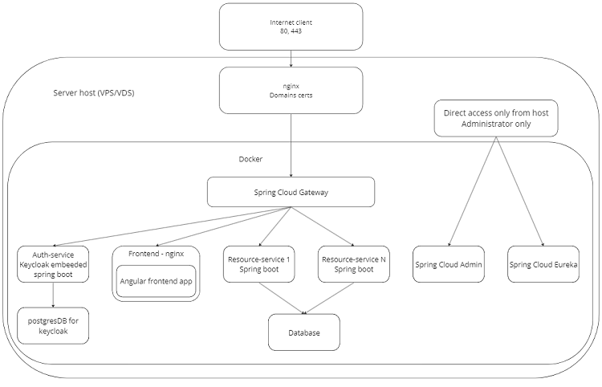

# Spring Cloud, Angular, Keycloak starter
## About
Base project to write microservice project with Spring Boot, Cloud, Angular and Keycloak
## Scheme

## Setup
1. setup vars in root build.gradle
```
ext {
   set('springCloudVersion', "2022.0.4")
   set('registry', '192.168.0.201:5000') // your registry
   set('dockerRemote', '192.168.0.201:2375') // your docker remote address
}
   ```
3. change docker-compose with your params and remove not needed to you exposed ports
4. change main.env and angular environments (environment.ts and environment.prod.ts) in main-site subproject with your vars (domain, realm, credentials, registry, etc)
5. run gradle clean bootBuildImage on main project (all subprojects automatically all subprojects will be built and pushed)
6. run /src/Docker-compose.yml with main.env in your docker
7. Open as you FRONTEND from .env, use credentials john@test.com/123
8. WARNING!!! For production you must remove from base-realm.json all "secret": from realm clients and remove test users - it's insecure!

## Subsprojects
### Backend-services
#### Gateway-service
Spring cloud gateway - org.springframework.cloud:spring-cloud-starter-gateway
#### Resource-server-template
Spring boot resource server (backend api service) - org.springframework.boot:spring-boot-starter-oauth2-resource-server
### Frontend-services
#### Main-site
Angular app automatically built in nginx docker container 
### Infra-services
#### Auth-service
Embedded in spring boot keycloak server.
#### Admin-service
Discovery service - org.springframework.cloud:spring-cloud-starter-netflix-eureka-server
and
Spring cloud admin - de.codecentric:spring-boot-admin-starter-server in /admin path
View cloud status.
Recommends to expose port, but only in secure tunnel (don't open to public).
Has Basic authentication!